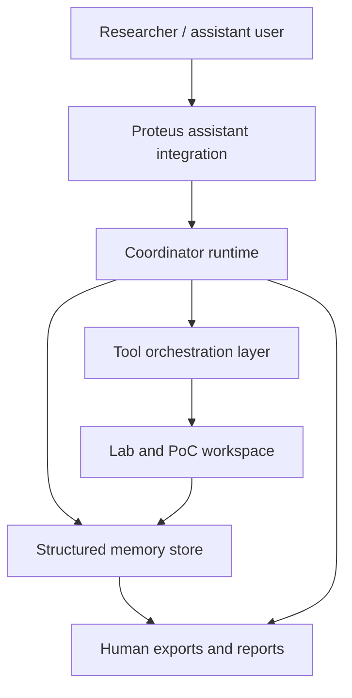
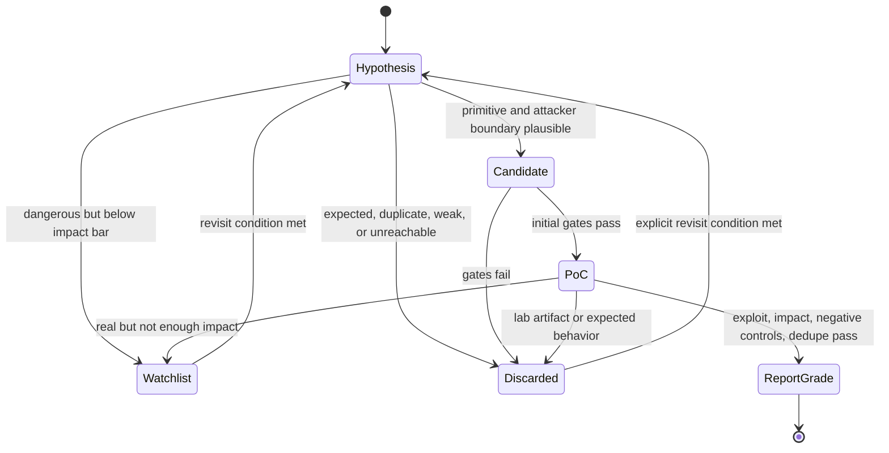

# Proteus Architecture

## 1. System Overview

Proteus is composed of five layers:



The assistant integration layer provides the agent instructions and interaction
surface for Codex, Claude Code, and MCP-capable hosts. The coordinator runtime
turns the research framework into a repeatable process. The
memory store preserves learned state. The tool layer instruments the target
environment. The lab layer validates candidates. Exports turn structured state
into readable Markdown and reports.

## 2. Core Components

### Assistant Integration Interface

Responsibilities:

- expose the `continuous-vuln-research` skill;
- provide default role prompts;
- define required research gates;
- expose command examples;
- keep the agent from treating the workflow as generic code review.

Implementation:

- Codex plugin manifest and skill;
- Claude Code plugin manifest, slash command, subagents, and MCP config;
- `SKILL.md`;
- Markdown templates;
- PowerShell and POSIX wrappers under `plugins/proteus/scripts`;
- MCP configuration under `plugins/proteus/.mcp.json`.

### Coordinator Runtime

Responsibilities:

- load target contract;
- query memory before each round;
- build or update the surface map;
- generate hypotheses;
- score ROI;
- create a round plan;
- produce bounded agent prompts;
- integrate outputs;
- promote, discard, or watch candidates;
- replan recursively.

The coordinator must be deterministic where possible: same memory plus same
target profile should produce an explainable plan, not random exploration.

### Memory Service

Responsibilities:

- provide a local database per target;
- store surfaces, symbols, invariants, hypotheses, candidates, evidence,
  probes, labs, decisions, and exports;
- support FTS dedupe;
- support anti-revisit queries;
- provide audit trail for why a candidate moved or died.

The memory service should expose a small CLI first and can later expose MCP
tools so Codex can query and write records directly.

### Target Mapper

Responsibilities:

- identify repo layout, packages, entrypoints, tests, docs, and build outputs;
- detect frameworks and runtime modes;
- map request flows and authority boundaries;
- identify parser, serializer, cache, storage, adapter, plugin, and callback
  surfaces;
- mark recent or security-relevant changes.

The mapper should not claim bugs. It feeds the coordinator with structured
attack surfaces.

### ROI Engine

Responsibilities:

- score surfaces and hypotheses;
- penalize repeated low-signal work;
- require revisit reasons for exhausted areas;
- keep round plans strategic;
- record why each surface was selected or skipped.

The ROI engine must be visible. Every round plan should show why a surface is in
scope now.

### Agent Orchestrator

Responsibilities:

- produce role-specific prompts;
- enforce disjoint work scopes;
- include prior discards and duplicate risks;
- require structured output;
- reject outputs missing covered surface, evidence, kill criteria, or next
  probes.

The orchestrator does not need to own parallel execution at first. It can start
as prompt generation plus output validation.

Canonical role names:

```text
Argus: component-level review.
Loom: macro/chaining analysis.
Chaos: fuzzing and edge-case generation.
Libris: docs/contract verification.
Mimic: runtime/adapter/environment divergence.
Artificer: PoC/lab construction.
Skeptic: adversarial review and refutation.
```

Memory records should store both the codename and the role family so exports are
readable while queries remain stable.

### Environment Instrumenter

Responsibilities:

- discover local tools;
- identify setup requirements;
- run smoke tests;
- capture versions;
- define safe execution profiles;
- detect Docker/WSL/native availability;
- record blockers.

Tool use must be explicit and logged. Environment changes should be minimal and
documented.

### Lab Manager

Responsibilities:

- create clean PoC/lab directories;
- enforce documented/default/correct-practice configuration;
- generate attack and negative-control checklists;
- attach logs, screenshots, requests, responses, test output, and traces;
- preserve reproduction commands.

The lab manager exists to prevent false positives created by the validation
environment.

### Intel and Dedupe Layer

Responsibilities:

- ingest local findings and reports;
- search prior logs;
- track public-known risk;
- record advisories, issues, PRs, discussions, changelog entries, and timeline;
- identify affected versions and likely introduction or fix points;
- block report-grade promotion until duplicate, public-known, expected-behavior,
  and timeline status are resolved.

This layer currently starts with local file ingestion plus full-text search in
SQLite. Public-intel fields are recorded through evidence and decision records.

### Exporter

Responsibilities:

- generate research logs;
- generate candidate registers;
- generate discarded-hypothesis reports;
- generate PoC README files;
- generate report drafts only after gates pass;
- keep report drafts triage-ready, concise, natural, and free of internal
  Proteus/workspace/process references.

Exports are views of memory, not the primary state.

## 3. Data Flow

```text
Research contract
  -> target observation
  -> memory ingest
  -> surface map
  -> hypothesis generation
  -> ROI scoring
  -> round plan
  -> agent prompts
  -> output validation
  -> coordinator validation
  -> memory update
  -> replan or PoC/report
```

The coordinator writes memory after every meaningful decision. A future run
should be able to answer:

- what was reviewed;
- why it was reviewed;
- what was learned;
- what was killed;
- what should not be reopened;
- what changed the next plan.

## 4. Round Plan Contract

Every research round must have:

```text
Round ID:
Objective:
Current target understanding:
High-ROI surfaces selected:
Surfaces intentionally skipped:
Prior killed paths to avoid:
Agent fronts:
Validation gates:
Expected evidence:
Stop conditions:
Replan trigger:
```

An agent cannot receive "review the repo". It receives a bounded surface and an
offensive heuristic.

## 5. Candidate State Machine



Promotion requires evidence. Downgrade requires a recorded reason.

## 6. Validation Gates

Report-grade candidates must pass:

```text
G1: root cause in target.
G2: realistic external attacker input.
G3: concrete security impact.
G4: documented/default/correct-practice configuration.
G5: negative controls pass.
G6: no duplicate in local findings/reports/logs.
G7: public-known, advisory, issue, changelog, and expected-behavior checks complete and documented.
G8: affected version, likely introduction point, and timeline understood.
G9: Skeptic refutation completed and rebutted.
G10: old/obvious class has exceptional impact or is killed.
G11: PoC does not depend on artificial lab help.
```

Pre-claim promotion requires recorded Libris and Skeptic outputs. Libris records
the public intel/timeline search, including sources and queries. Skeptic records
the strongest refutation arguments and whether each was rebutted, unresolved, or
fatal. Any unresolved refutation or unavailable intel keeps the candidate below
report-grade.

Immediate kill reasons:

- no realistic attacker boundary;
- UI-only stale state with no authority;
- weak crash or weak DoS;
- integration-only issue outside target responsibility;
- explicitly unsafe configuration only;
- expected/documented behavior;
- duplicate of an existing finding;
- old trivial bug with weak impact.

## 7. Runtime and Technology Plan

Phase 1 should use:

- TypeScript runtime;
- SQLite memory database;
- Zod schemas;
- Markdown templates;
- Node child process orchestration;
- optional Python helpers for ecosystem-specific analysis;
- CLI first, MCP later.

Expected commands:

```text
vros init <target>
vros ingest <path>
vros observe
vros plan-round
vros prompt-agents
vros record <entity>
vros validate-output <file>
vros query duplicates <text>
vros query revisit <surface>
vros export markdown
vros lab create <candidate-id>
```

## 8. Integration With Assistant Hosts

The assistant integration should instruct the agent to:

- use goal or campaign mechanisms for user-requested continuous campaigns or
  persistent objectives when the capability is available;
- use available subagents for parallel, independent Proteus fronts when the
  session allows delegation;
- initialize or load target memory;
- inspect existing findings/reports before new work;
- create a round plan before delegating;
- map every subagent to one codename, one bounded surface, one heuristic family,
  and explicit kill criteria;
- update memory after decisions;
- build labs only after candidate gates;
- preserve discarded paths and playbook material;
- stop on report-grade candidates, exhaustion, blockers, or user interruption.

The coordinator remains the authority for strategy and evidence quality. Codex
subagents may explore bounded fronts, but they do not promote findings directly.
Goal mode may keep a campaign alive across long work, but stop conditions,
replan triggers, and validation gates still come from Proteus memory.

Proteus exposes memory commands as MCP tools through `dist/mcp.js`, while the
CLI remains available for terminal-first workflows and smoke testing.

## 9. Security and Reliability Notes

The runtime will execute local tools. It must:

- show planned commands before destructive or environment-changing actions;
- avoid modifying target code unless explicitly building a PoC or fixture;
- keep PoC changes isolated;
- record environment versions;
- avoid storing secrets in exports;
- allow redaction of requests, tokens, and credentials;
- maintain append-only evidence where feasible.

## 10. Open Design Questions

- Should the first runtime be pure TypeScript or TypeScript with Python helper
  packages?
- Should MCP be implemented in M1 or after the CLI is stable?
- Should the memory store be one database per target or one global database with
  target namespaces?
- How strict should output validation be before the system rejects an agent
  result?
- Should public-intel search be manual checklist first or tool-assisted from
  the beginning?
